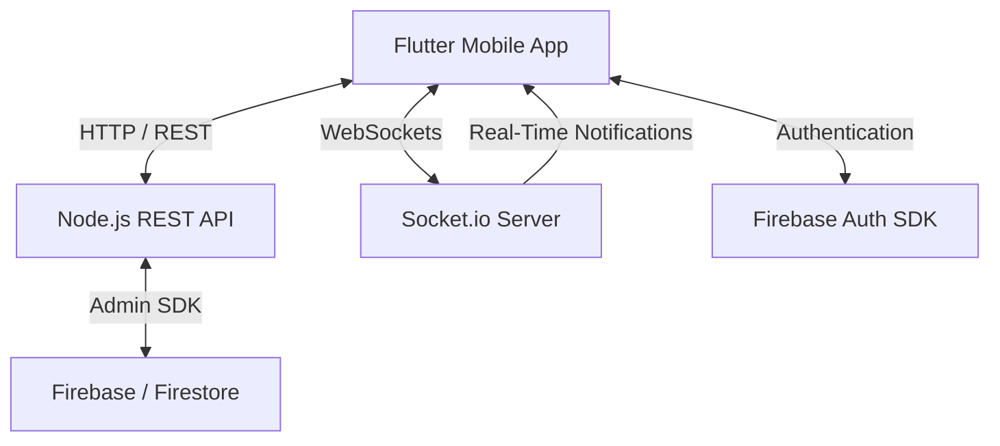

# 🩸 BloodSOS

**BloodSOS** is a real-time emergency blood requesting and donor discovery platform designed to connect **patients, blood donors, and hospitals** during urgent blood requirements.

The platform combines a cross-platform **Flutter mobile application** with a real-time backend powered by **Node.js, Express, TypeScript, Socket.io, and Firebase**.

BloodSOS focuses on reducing the time required to find eligible blood donors by providing real-time emergency requests, location-based discovery, role-specific workflows, and live notifications.

---

## 🎯 Project Overview

Finding a suitable blood donor during an emergency can be difficult and time-sensitive.

BloodSOS provides a centralized platform where:

- 🏥 Hospitals can create emergency blood requests
- 🧑‍🩸 Donors can discover relevant requests
- 🧑‍⚕️ Patients can request blood during emergencies
- 📍 Location information helps identify nearby requests
- ⚡ Socket.io enables real-time request notifications
- 🔐 Firebase Authentication manages user authentication
- ☁️ Firebase/Firestore stores application data
- 📱 Flutter provides a cross-platform mobile experience

---

# 🏛️ System Architecture



### Architecture Components

| Component | Technology | Responsibility |
|---|---|---|
| Mobile Application | Flutter | User interface and client-side workflows |
| State Management | Riverpod | Application state and dependency management |
| Routing | GoRouter | Navigation and route management |
| HTTP Client | Dio | REST API communication |
| Local Storage | Hive | Local caching and offline fallback |
| Backend | Node.js + TypeScript | Server-side application logic |
| REST API | Express | HTTP API endpoints |
| Real-Time Layer | Socket.io | Live emergency request notifications |
| Authentication | Firebase Auth | User authentication |
| Database | Firebase / Firestore | User profiles and application data |
| Backend Firebase Access | Firebase Admin SDK | Server-side Firebase operations |

---

# 👥 User Roles

BloodSOS is designed around multiple user types with role-specific workflows.

### 🩸 Donor

Donors can:

- Create a donor account
- Maintain their donor profile
- Provide relevant blood information
- Discover emergency blood requests
- Receive real-time notifications
- View request locations
- Respond to suitable requests

### 🧑‍⚕️ Patient

Patients can:

- Register and manage their profile
- Create emergency blood requests
- Specify required blood information
- View request status
- Receive relevant updates

### 🏥 Hospital

Hospitals can:

- Register as a healthcare organization
- Create emergency blood requests
- Provide request information
- Monitor emergency requests
- Receive donor responses
- Manage request-related information

---

# 🚨 Emergency Blood Requests

The core functionality of BloodSOS is its emergency request system.

A typical workflow is:

```text
Create Blood Request
        ↓
Request Validation
        ↓
Request Published
        ↓
Location / Eligibility Matching
        ↓
Socket.io Notification
        ↓
Nearby Eligible Donors
        ↓
Donor Response
        ↓
Request Status Updated
```

Emergency requests can contain relevant information such as:

- Blood group
- Required quantity
- Request urgency
- Patient information
- Hospital information
- Request location
- Contact information
- Request status

---

# ⚡ Real-Time Communication

BloodSOS uses **Socket.io** to provide real-time communication between the backend and connected Flutter clients.

When an emergency blood request is created, the backend can notify relevant connected users without requiring the application to repeatedly refresh the request list.

```text
Hospital / Patient
       │
       ↓
Create Emergency Request
       │
       ↓
Node.js API
       │
       ↓
Socket.io Server
       │
       ├───────────────┐
       ↓               ↓
Eligible Donor A   Eligible Donor B
       │               │
       └───────┬───────┘
               ↓
        Real-Time Alert
```

This real-time architecture is particularly useful for emergency scenarios where response time matters.

---

# 📍 Location & Geolocation

BloodSOS incorporates location-aware functionality to help users understand where emergency requests are located.

The application can provide:

- Request locations
- Geographic proximity information
- Map-based request discovery
- Location-aware donor discovery
- Dynamic request positioning

The location system can help donors identify emergency requests that are geographically relevant to them.

---

# 🗺️ Maps & Request Discovery

Emergency requests can be presented using location-based interfaces.

A typical discovery flow:

```text
Current User Location
        ↓
Fetch Emergency Requests
        ↓
Determine Request Locations
        ↓
Calculate / Display Proximity
        ↓
Show Relevant Requests
        ↓
Open Request Details
```

---

# 🔐 Authentication & Authorization

Firebase Authentication provides the client-side authentication layer.

BloodSOS supports structured registration flows for different user roles.

```text
                 Authentication
                       │
          ┌────────────┼────────────┐
          ↓            ↓            ↓
       Donor         Patient      Hospital
          │            │            │
          ↓            ↓            ↓
     Donor Flow    Patient Flow   Hospital Flow
```

The backend uses the **Firebase Admin SDK** to perform server-side authentication and user/profile verification.

---

# 💾 Offline Caching & Fallbacks

BloodSOS uses **Hive-based local storage** to provide caching and fallback behavior.

This helps the application remain usable when network connectivity is temporarily unavailable or an API endpoint cannot be reached.

```text
Flutter Application
        │
        ↓
    Network Request
        │
    ┌───┴────┐
    ↓        ↓
 Online    Offline
    │        │
    ↓        ↓
 REST API   Hive Cache
    │        │
    └───┬────┘
        ↓
    Application
```

Cached information can help maintain a smoother navigation experience while connectivity is restored.

---

# 🛠️ Features

## 🔐 Multi-Role Authentication

- Donor registration
- Patient registration
- Hospital registration
- Role-specific workflows
- Firebase Authentication
- Server-side profile verification

## 🚨 Emergency Blood Requests

- Create emergency requests
- Blood group requirements
- Request status management
- Hospital/patient request information
- Real-time request distribution

## ⚡ Real-Time Notifications

- Socket.io WebSocket communication
- Live emergency request updates
- Connected donor notifications
- Real-time request state changes

## 📍 Location-Based Discovery

- Request locations
- Geographic proximity
- Map-based request discovery
- Location-aware donor workflows

## 💾 Offline Support

- Hive-based caching
- Offline navigation fallback
- Cached data access
- Network-aware application behavior

## 📱 Cross-Platform Application

Flutter provides a shared application codebase for supported platforms while maintaining a mobile-first experience.

---

# 📱 Flutter Architecture

The mobile application uses a layered structure around feature modules and shared application services.

A representative structure is:

```text
lib/
│
├── core/
│   ├── network/
│   │   └── api_client.dart
│   │
│   ├── services/
│   │   └── ...
│   │
│   ├── routing/
│   └── utils/
│
├── features/
│   ├── authentication/
│   ├── donors/
│   ├── patients/
│   ├── hospitals/
│   ├── blood_requests/
│   ├── maps/
│   └── profile/
│
├── providers/
│   └── providers.dart
│
└── main.dart
```

The exact structure can evolve as additional application modules are introduced.

---

# 🖥️ Backend Architecture

The backend is built with **Node.js, TypeScript, Express, and Socket.io**.

A representative structure:

```text
backend/
│
├── src/
│   ├── controllers/
│   ├── routes/
│   ├── services/
│   ├── middleware/
│   ├── sockets/
│   ├── models/
│   └── config/
│
├── .env
├── package.json
├── tsconfig.json
└── ...
```

### Backend Responsibilities

- REST API handling
- Authentication verification
- User/profile management
- Blood request management
- Request validation
- Firebase Admin integration
- Firestore operations
- Socket.io communication
- Real-time event handling

---

# 🛠️ Technology Stack

## Frontend

- **Flutter**
- **Dart**
- **Riverpod**
- **GoRouter**
- **Dio**
- **Hive**

## Backend

- **Node.js**
- **TypeScript**
- **Express.js**
- **Socket.io**
- **Firebase Admin SDK**

## Cloud Services

- **Firebase Authentication**
- **Cloud Firestore**

## Architecture

- REST APIs
- WebSockets
- Reactive state management
- Local caching
- Location-aware services

---

# 🚀 Getting Started

## Prerequisites

Install the following before setting up the project:

- **Flutter SDK** `3.22.0+`
- **Dart SDK**
- **Node.js** `18.x+`
- **NPM** `9.x+`
- Android Studio or VS Code
- Android Emulator or physical Android device
- Firebase project
- Firebase Authentication enabled
- Cloud Firestore enabled

Verify Flutter:

```bash
flutter doctor
```

Verify Node.js:

```bash
node --version
```

Verify NPM:

```bash
npm --version
```

---

# 💻 Backend Setup

### 1. Navigate to Backend

```bash
cd backend
```

### 2. Install Dependencies

```bash
npm install
```

### 3. Configure Environment Variables

Create a `.env` file inside the `backend` directory:

```env
PORT=3000
FIREBASE_SERVICE_ACCOUNT_PATH=./firebase-service-account.json
```

Add any additional environment variables required by the current backend implementation.

### 4. Configure Firebase Admin

From the Firebase Console:

```text
Firebase Console
      ↓
Project Settings
      ↓
Service Accounts
      ↓
Generate New Private Key
```

Download the service account JSON file and place it inside:

```text
backend/firebase-service-account.json
```

**Do not commit this file to Git.**

### 5. Start Development Server

```bash
npm run dev
```

The backend should start on the configured port.

---

# 📱 Flutter Setup

From the project root:

```bash
flutter pub get
```

Configure Firebase for the Flutter application:

```bash
flutterfire configure
```

This generates or updates the Firebase configuration used by the Flutter client.

---

# 🌐 Connecting a Physical Device

When running the Flutter application on a physical phone, the phone must be able to reach the development computer running the Node.js backend.

### 1. Connect Both Devices to the Same Network

Your computer and phone should be connected to the same Wi-Fi network.

### 2. Find Your Computer's Local IP

On Windows:

```bash
ipconfig
```

Look for the active network adapter's IPv4 address.

Example:

```text
192.168.1.100
```

### 3. Update the Flutter API URL

Update the development server address in:

```text
lib/core/network/api_client.dart
```

For example:

```text
http://192.168.1.100:3000
```

### 4. Update Socket.io Configuration

Update the Socket.io server address in:

```text
lib/core/services/providers.dart
```

Use the same development machine IP and configured backend port.

### 5. Run Flutter

```bash
flutter run
```

---

# 🔄 Development Environment

The overall development setup looks like:

```text
┌───────────────────────┐
│    Flutter Device     │
│                       │
│  Android / Emulator   │
└───────────┬───────────┘
            │
      HTTP / WebSocket
            │
            ↓
┌───────────────────────┐
│    Node.js Backend    │
│                       │
│ Express + Socket.io   │
└───────────┬───────────┘
            │
            ↓
┌───────────────────────┐
│ Firebase / Firestore  │
│                       │
│ Auth + Database       │
└───────────────────────┘
```

---

# 🧪 Development Commands

### Flutter

```bash
flutter pub get
flutter run
```

Analyze the Flutter project:

```bash
flutter analyze
```

Run Flutter tests:

```bash
flutter test
```

Format Dart code:

```bash
dart format .
```

### Backend

Install dependencies:

```bash
npm install
```

Start development server:

```bash
npm run dev
```

Build TypeScript:

```bash
npm run build
```

Start production server:

```bash
npm start
```

> Backend commands depend on the scripts defined in `package.json`.

---

# 🔒 Security

BloodSOS handles potentially sensitive user and emergency information, so production deployments should follow strong security practices.

### Important Rules

- Never commit Firebase service-account credentials.
- Never expose private Firebase Admin credentials in Flutter.
- Keep `.env` files out of version control.
- Validate all incoming API requests.
- Verify Firebase authentication tokens on the backend.
- Apply appropriate Firestore security rules.
- Restrict sensitive backend endpoints by role.
- Validate donor and request information server-side.
- Use HTTPS in production.
- Use secure WebSocket connections in production.
- Avoid exposing unnecessary patient information.

Recommended `.gitignore` entries:

```gitignore
.env
firebase-service-account.json
*.keystore
*.jks
```

---

# ⚠️ Emergency & Medical Disclaimer

BloodSOS is a **software project and communication platform**.

It should not replace professional medical advice, emergency medical services, blood-bank procedures, or hospital protocols.

In a real-world deployment, blood requests and donor eligibility should be verified through appropriate medical professionals, hospitals, or authorized blood banks.

---

# 🔮 Future Improvements

Potential future enhancements include:

- 🔔 Push notifications
- 📍 Advanced donor-to-request distance matching
- 🩸 Donor eligibility tracking
- 📅 Donor availability scheduling
- 🏥 Hospital verification
- 🪪 Verified donor profiles
- 📊 Request analytics
- 🗺️ Improved map and route integration
- 💬 Donor/request communication
- 📞 Emergency contact workflows
- 🔄 Advanced request matching
- 🛡️ Stronger role-based authorization
- 📱 Background location capabilities where appropriate
- ☁️ Production deployment infrastructure
- 📈 Admin dashboard
- 📋 Blood donation history

---

# 📌 Project Status

**Active Development / Academic Project**

BloodSOS is designed as a practical demonstration of how Flutter, REST APIs, Firebase, WebSockets, local caching, and location-aware functionality can work together to build a real-time emergency coordination platform.

---

# 👨‍💻 Author

**Rohan Ali**

**Flutter & Mobile Application Developer**

- GitHub: [R0hanAli](https://github.com/R0hanAli)
- LinkedIn: [Rohan Ali](https://linkedin.com/in/rohan-ali-a59a673a2)

---

# 📄 License

This project is intended primarily for **educational and development purposes**.

Add an appropriate open-source license if the project is intended for public distribution.

---

## 🩸 BloodSOS

> **Connect faster. Respond sooner. Help save lives.**
