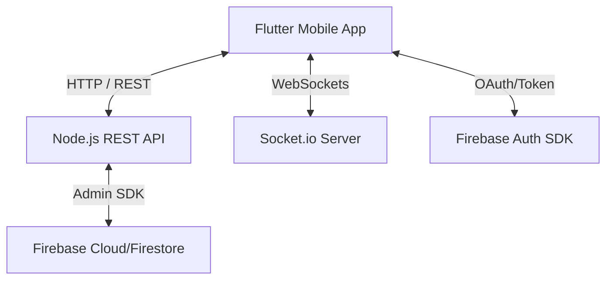

# BloodSOS 🩸

BloodSOS is a real-time, emergency blood requesting and donor discovery platform. The project consists of a cross-platform mobile application built with Flutter and a backend service powered by Node.js, Express, Socket.io, and Firebase.

---

## 🏛️ Project Architecture



- **Frontend:** Flutter client utilizing Riverpod for state management, Dio for network communications, and GoRouter for routing.
- **Backend:** Node.js server written in TypeScript using Express for routing and Socket.io for real-time WebSocket notifications.
- **Database / Auth:** Firebase Auth handles secure authentication on the client side, while Firebase Admin SDK controls profiles and state verification in the backend database.

---

## 🚀 Getting Started

### 1. Prerequisites
- **Flutter SDK** (v3.22.0 or higher recommended)
- **Node.js** (v18.x or higher)
- **NPM** (v9.x or higher)
- A Firebase project with Firestore and Authentication enabled.

---

### 💻 Backend Setup

1. **Navigate to the backend directory:**
   ```bash
   cd backend
   ```

2. **Install dependencies:**
   ```bash
   npm install
   ```

3. **Configure Environment Variables (`.env`):**
   Create a `.env` file in the `backend/` directory:
   ```env
   PORT=3000
   FIREBASE_SERVICE_ACCOUNT_PATH=./firebase-service-account.json
   ```

4. **Add Firebase Credentials:**
   - Go to your [Firebase Console](https://console.firebase.google.com/).
   - Navigate to **Project Settings > Service Accounts**.
   - Click **Generate new private key** and download the JSON file.
   - Rename this file to `firebase-service-account.json` and place it in the `backend/` directory.

5. **Run the server in development mode:**
   ```bash
   npm run dev
   ```
   *You should see the message: `Firebase Admin initialized successfully using service account key file.`*

---

### 📱 Flutter App Setup

1. **Get client dependencies:**
   ```bash
   flutter pub get
   ```

2. **Register your app with Firebase:**
   Make sure you run the FlutterFire CLI to generate/update the configuration:
   ```bash
   flutterfire configure
   ```

3. **Running on Emulator vs. Real Devices:**
   To connect the app running on a physical phone to your development machine:
   - Make sure both your computer and phone are on the **same Wi-Fi network**.
   - Find your computer's local IP address (e.g., run `ipconfig` on Windows or `ifconfig` on macOS/Linux).
   - Update the configuration in these files:
     - **REST API URL:** Edit `_kDevServerIp` in [api_client.dart](file:///c:/Users/user/blood_sos/lib/core/network/api_client.dart).
     - **WebSockets URL:** Edit `socketServiceProvider` in [providers.dart](file:///c:/Users/user/blood_sos/lib/core/services/providers.dart).

4. **Launch the application:**
   ```bash
   flutter run
   ```

---

## 🛠️ Features

- **Multi-Role Authentication:** Supports Donors, Patients, and Hospitals with structured, distinct registration flows.
- **Real-Time Requests:** Hospitals and patients can create emergency blood requests that trigger live notifications to nearby eligible donors via Socket.io.
- **Dynamic Maps/Geolocations:** View locations of emergency requests and track proximity dynamically.
- **Caching & Fallbacks:** Seamless offline navigation using Hive-based storage services when endpoints are unreachable.
